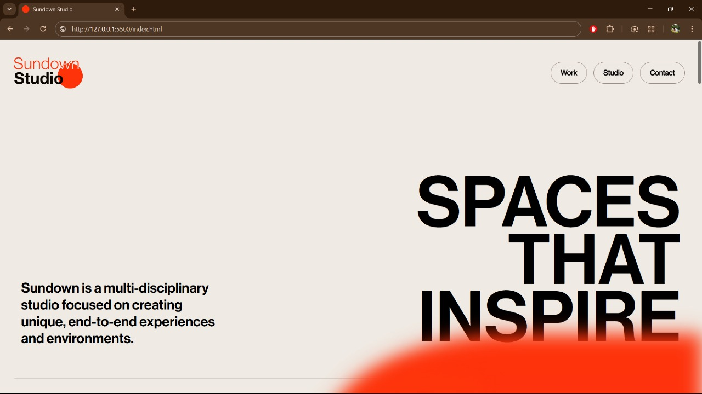
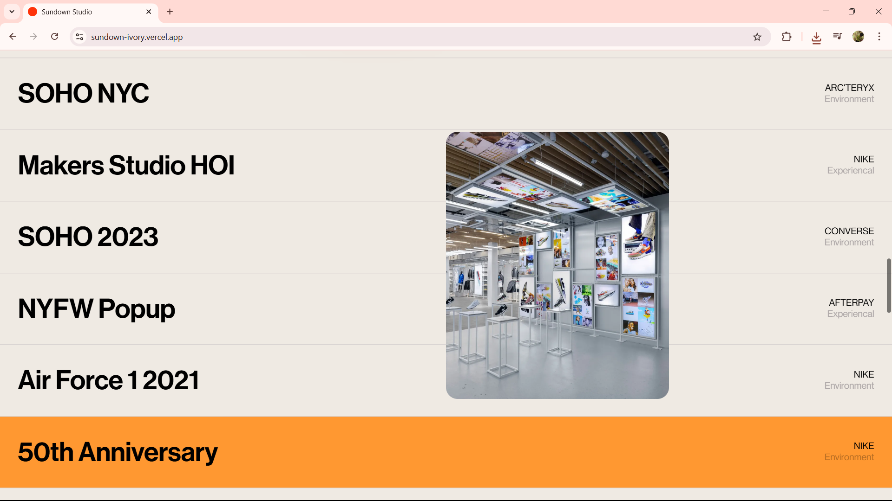
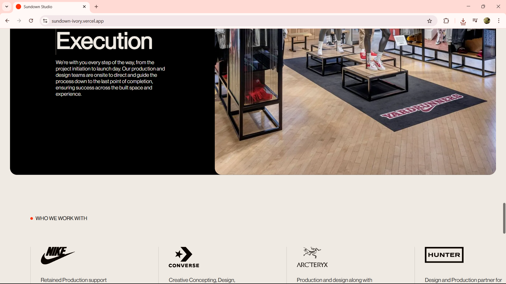
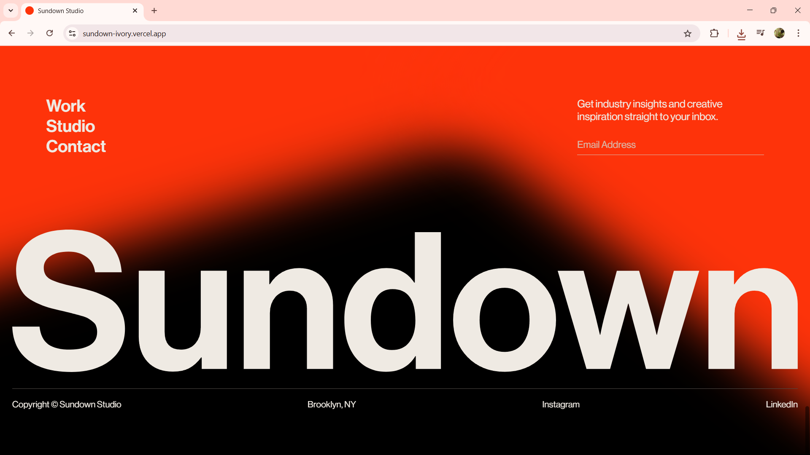

# Sundown Studio Clone

A frontend recreation of the Sundown Studios website using HTML, CSS, and JavaScript.

## 📸 Preview

 
 

## Features

- Responsive design
- Smooth animations
- Interactive UI elements

## Technologies Used

- HTML5
- CSS3
- JavaScript (ES6)

## Installation

1. Clone the repository:

   ```bash
   git clone https://github.com/prathamwho/Sundown-Studio-Clone.git
   ```

2. Navigate to the project directory:

```bash
cd Sundown-Studio-Clone
```
3. Open index.html in your preferred web browser.

🙌 Acknowledgements
Sundown Studios for the original design inspiration.

---

### 📄 requirements.txt

```
plaintext
# No external dependencies required.
# Ensure a modern web browser for optimal performance.
